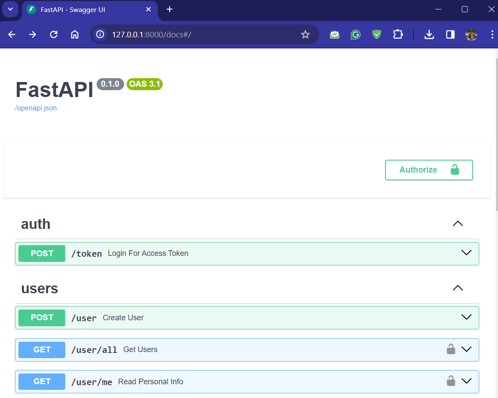
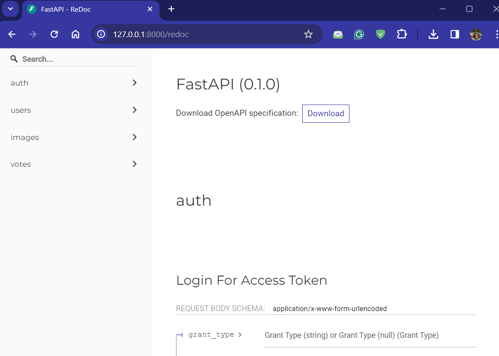

# elyamash-backend


Elyamash is an application inspired from Facemash that will allow the employees who will be presented with pairs of photos and asked to choose which image they found more appealing.

Elyamash is an application inspired from Facemash that will allow the users who will be presented with pairs of photos and asked to choose which image they found more appealing.

The application facilitates quick comparisons between pairs of photos, allowing users to select by clicking on the photo they preferred. Based on the votes received, Elyamash calculates ratings and displays rankings of the most eye-catching photos, dynamically updating the rankings based on user interactions.

This portion of the app "elyamash-backend" is focused particularly in the context of building and designing APIs. I worked on creating APIs that enable applications to interact with data efficiently. This involved understanding how to structure and define APIs, ensuring they are secure, performant, and scalable.

## Requirements

Python 3.12

Use the package manager [pip](https://pip.pypa.io/en/stable/) to install :

* fastapi
* uvicorn
* pydantic
* azure-blob-storage
* sqlalchemy
* jose
* behave
* bcrypt

## Installation

```bash
$pip install -r requirements.txt
```

## Run Server

Run the server with:

```bash
$ uvicorn main:app --reload

INFO:     Uvicorn running on http://127.0.0.1:8000 (Press CTRL+C to quit)
INFO:     Started reloader process [28720]
INFO:     Started server process [28722]
INFO:     Waiting for application startup.
INFO:     Application startup complete.
```

### Interactive API docs

Now go to (http://127.0.0.1:8000/docs)[http://127.0.0.1:8000/docs](http://127.0.0.1:8000/docs).

You will see the automatic interactive API documentation (provided by Swagger UI):



### Alternative API docs

And now, go to (http://127.0.0.1:8000/redoc)[http://127.0.0.1:8000/redoc](http://127.0.0.1:8000/redoc).

You will see the alternative automatic documentation (provided by [ReDoc](https://github.com/Rebilly/ReDoc)):



## Test the endpoints

You can test the endpoints through the interactive API
